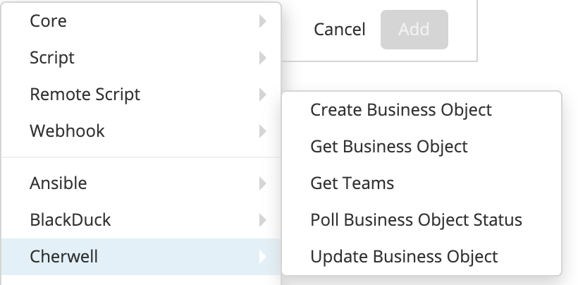
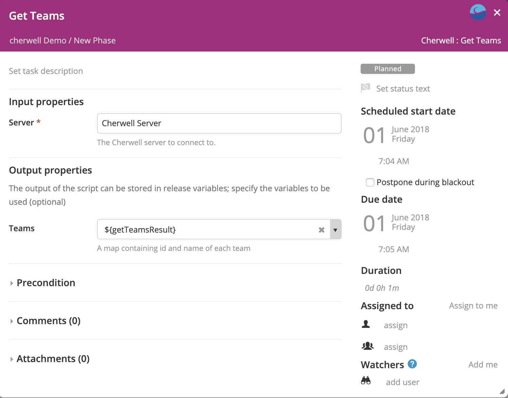
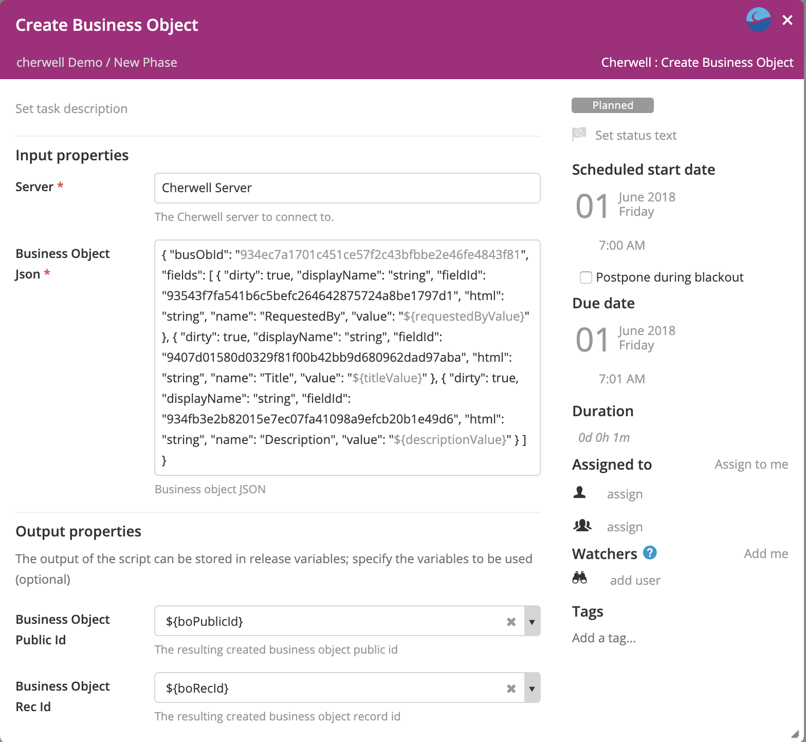
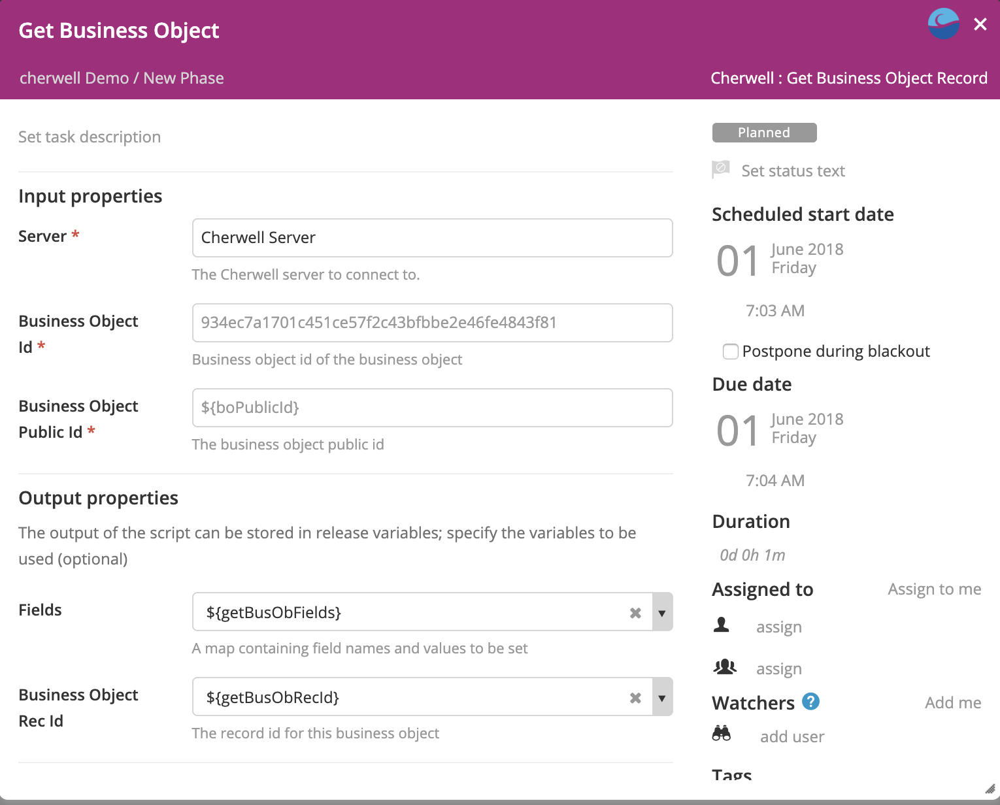
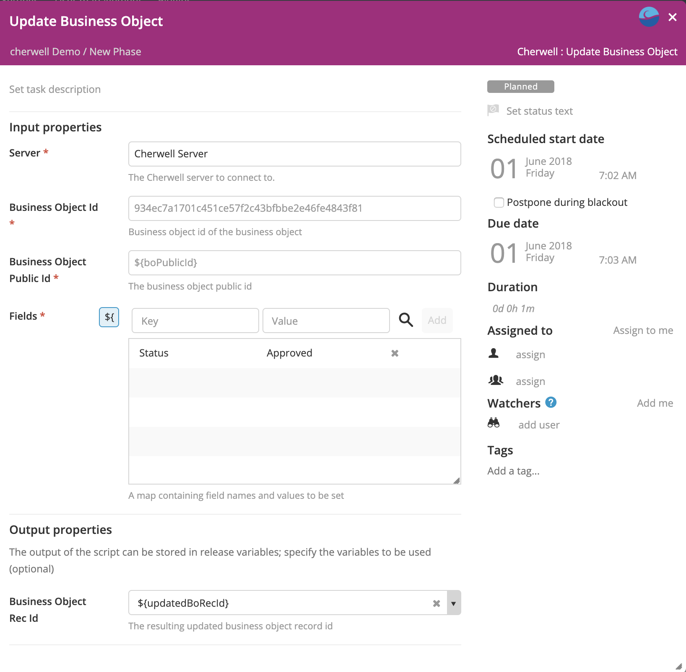
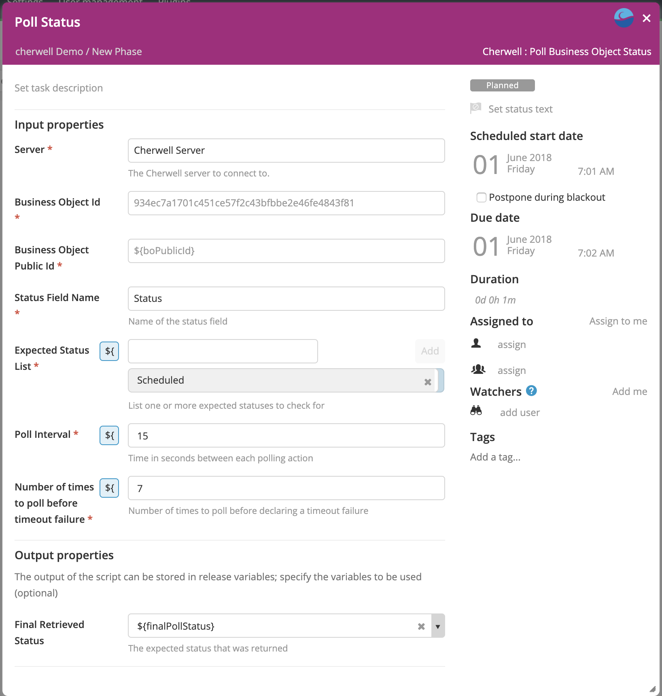

# XL Release Cherwell Plugin v1.0.0

[![Build Status][xlr-cherwell-plugin-travis-image]][xlr-cherwell-plugin-travis-url]
[![License: MIT][xlr-cherwell-plugin-license-image]][xlr-cherwell-plugin-license-url]
![Github All Releases][xlr-cherwell-plugin-downloads-image]


## Preface

This document describes the functionality provided by the XL Release Cherwell plugin.
  
See the [XL Release reference manual](https://docs.xebialabs.com/xl-release) for background information on XL Release and release automation concepts.  

## Overview

## Requirements

Note:  XLR version should not be lower than lowest supported version.  See <https://support.xebialabs.com/hc/en-us/articles/115003299946-Supported-XebiaLabs-product-versions>.

## Installation

* Copy the latest JAR file from the [releases page](https://github.com/xebialabs-community/xlr-cherwell-plugin/releases) into the `XL_RELEASE_SERVER/plugins/__local__` directory.
* Restart the XL Release server.

## Features/Usage/Types/Tasks



### Get Team List

Get a list of team names from Cherwell



### Create Business Object

Create a new Cherwell Business Object



#### Example JSON for 'Create Business Object - Business Object Json Field'
        ```
        {
            "busObId": "${busObId}",
            "fields": [
                {
                "dirty": true,
                "displayName": "string",
                "fieldId": "93543f7fa541b6c5befc264642875724a8be1797d1",
                "html": "string",
                "name": "RequestedBy",
                "value": "${requestedByValue}"
                },
                {
                "dirty": true,
                "displayName": "string",
                "fieldId": "9407d01580d0329f81f00b42bb9d680962dad97aba",
                "html": "string",
                "name": "Title",
                "value": "${titleValue}"
                },
                {
                "dirty": true,
                "displayName": "string",
                "fieldId": "934fb3e2b82015e7ec07fa41098a9efcb20b1e49d6",
                "html": "string",
                "name": "Description",
                "value": "${descriptionValue}"
                }
            ]
        }


        ```

### Get Business Object

This task retrieves a list of Business Object fields and values.



### Update Business Object

This task updates fields in a Business Object



### Poll Business Object for field value change

This task polls a Business Object field and looks for an expected value change. The task can be configured with a list of possible expected values. The task will complete successfully the first time any one of the expected values is detected. The detected value will be displayed in the completed task output.




## References

* [Cherwell API](https://cherwellsupport.com/WebHelp/csm/en/9.2/content/system_administration/rest_api/csm_rest_api_landing_page.html)
* [Swagger - Cherwell Rest API](https://cherwellsupport.com/CherwellAPI/Swagger/ui/index)

## Develop and Demo

Build and package the plugin with...

```bash
./gradlew clean build
```

### To run integration tests - 
1.  You will need to have Docker and Docker Compose installed 
2.  The XL-Release image expects to find a valid XL-Release license on your machine, at this location: ~xl-licenses/xl-release-license.lic
3.  Open a terminal in the root of the xlr-cherwell-plugin project and run the test - 

```bash
./gradlew clean integrationTest
```
    
The test will set up a temporary xlr/mockserver testbed using docker. NOTE: The integration tests take about 5 minutes to run. 
1. The mock server is used to act as a stand-in for a Cherwell server. The mockserver will send Cherwell-like responses to XL Release requests.
2. After testing is complete, the test docker containers are stopped and removed. 

### To run demo or dev version (set up the docker containers and leave them running) -
1.  For requirements, see the 'To run integration tests' above
2.  Build the xlr-cherwell-plugin.jar - Open a terminal and cd into <xlr-cherwell-plugin code base> and run ./gradlew clean build . Be sure to re-run the command whenever code is changed. 
3.  From another terminal, cd into the <xlr-cherwell-plugin code base>/src/test/resources/docker/  directory. 
4.  Run (necessary the first time only): docker-compose build
5.  Then run: docker-compose up -d 
6.  XL Release will run on the [localhost port 15516](http://localhost:15516/). It may take up to a minute for XL Release to start up
7.  The XL Release username / password is admin / admin
8.  After XL Release has started, you can set up a template and shared configuration server by running the script <xlr-cherwell-plugin code base>/src/test/resources/docker/initialize/initialize_data.sh. Alternatively, follow the steps below:
    1.  within XL Release->Settings->Shared Configurations, configure a Cherwell Host with the following attributes:
        1.  Title -> Cherwell Server
        2.  Url -> http://mockserver:5000
        3.  Auth mode -> LDAP
        4.  Username -> USERNAME
        5.  Password -> PASSWORD
        6.  API Key -> API_KEY
    2.  Within XL Release, navigate to the Templates page and use the import feature to import the template located here: <xlr-cherwell-plugin code base>/src/test/resources/docker/initialize/data/release-template-cherwell.json .
9.  You can now run a release based the template named 'cherwell demo'.
10. When code is modified, re-run the ./gradlew clean build (in the first terminal), then refresh the testbed by running docker-compose down followed by docker-compose up -d (in the second terminal) and after XL Release starts up, re-import the server configuration and the template

Further Demo/Dev Notes:
1. The log file for the plugin - cherwell-plugin.log will be persisted to the local directory <xlr-selenim-plugin code base>/build/reports/tests/log directory. You may need to modify the log configuration (located in __init__.py) to DEBUG rather than INFO
2. The Mockserver runs on the [localhost port 5099](http://localhost:5099/)
3. The example mockserver Cherwell responses are located in the <xlr-cherwell-plugin code base>/src/test/resources/mockserver/responses directory
4. If you add example responses, be sure to rebuild the mockserver docker image


[xlr-cherwell-plugin-travis-image]: https://travis-ci.org/xebialabs-community/xlr-cherwell-plugin.svg?branch=master
[xlr-cherwell-plugin-travis-url]: https://travis-ci.org/xebialabs-community/xlr-cherwell-plugin
[xlr-cherwell-plugin-license-image]: https://img.shields.io/badge/License-MIT-yellow.svg
[xlr-cherwell-plugin-license-url]: https://opensource.org/licenses/MIT
[xlr-cherwell-plugin-downloads-image]: https://img.shields.io/github/downloads/xebialabs-community/xlr-cherwell-plugin/total.svg

